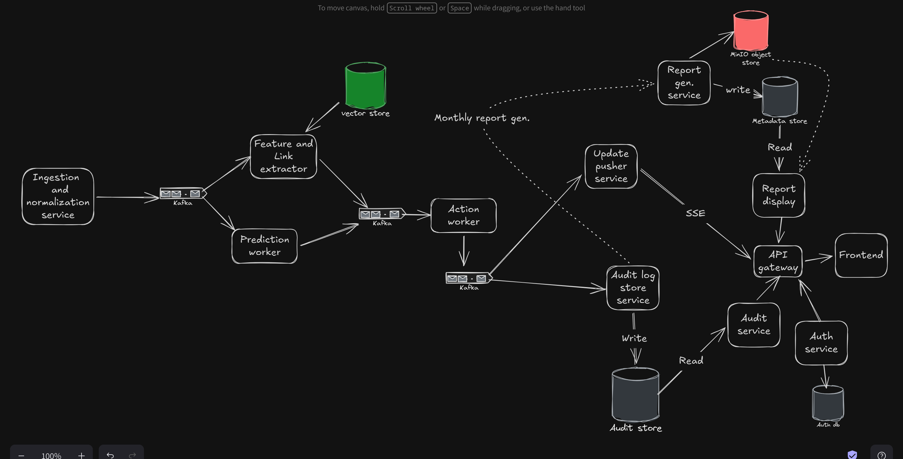

# Aegisrisk
High-throughput, event-driven fraud prevention and automated dispute recovery engine built for Razorpay merchants.

## Basic Flow/Working
AegisRisk ingests live payment events, performs parallel vector store feature extraction and ML risk scoring via Kafka streams, and executes bounded defence actions, thereby protecting merchant revenue while maintaining an immutable audit trial.

## Architecture

## Tech Stack
1. Backend services: FastAPI (python)
2. Queue System: Kafka
3. Vector store: QDrant
4. Object store: MinIO
5. Database: PostgreSQL
6. API Gateway: Kong
7. Frontend: NextJS
8. Deployment: Helm, K8s

